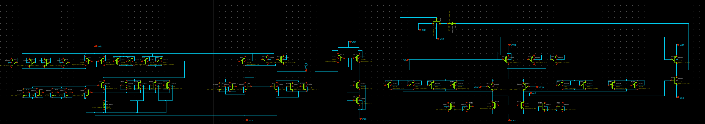
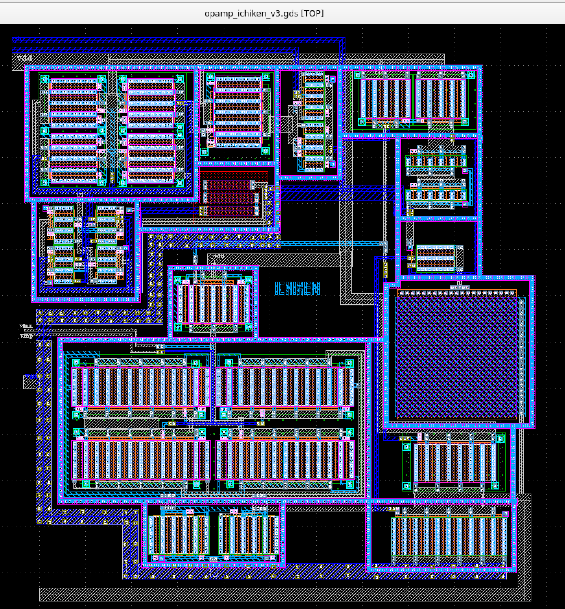

# ISHI会版OpenMPW PTC06-2について
これは、[ISHI会版OpenMPW PTC06-2](https://ishi-kai.org/openmpw/shuttle/ptc06/2025/05/24/shuttle_ISHI-Kai_OpenMPW-PTC06-2_start.html)にみんなで相乗りしたxschemによる回路図とklayoutによるレイアアウト置き場です。

## みんなの[相乗りチップ](Submitted/all_members_layout.gds)
- 
- 

### 相乗りチップのラベル
- 緑枠  
-- 独自設計の回路  
- オレンジ枠  
-- 初めてのInverter回路  
- 紫枠  
-- 初めてのInverter回路だけどピン不足によりレイアアウト配置のみ  

# 参加者リスト
- [aidera](./member_project/aidera/)
- [arstopia](./member_project/arstopia/)
- [konikoni428](./member_project/konikoni428/)
- [reodon](./member_project/reodon/)
- [YutakaKOTANI](./member_project/YutakaKOTANI/)
- [ICHIKEN](./member_project/ichiken/)

## 各種リスト
- [メンバーリスト](docs/member_list.pdf)
- [ピンリスト](docs/pin_list.pdf)

# 参加者のデザイン
## [aidera](./member_project/aidera/)：Inverter回路
### 感想
大学で電気工学を専攻して以来、こういった設計は久しぶりで  
初めてのチップ設計で難しかったですが  
チップ設計の雰囲気がわかり面白かったです。  
このような実際に設計から実際に製造していただけるような  
企画は他になく、貴重な機会をいただきありがとうございました。  

- 
- 

## [arstopia](./member_project/arstopia/)：Inverter回路
### 感想
その昔、とあるアーキテクチャの研究室で半導体設計は一瞬かすったのですが、今回、半導体のチップ製造までしていただけるとのことでまた勉強してみようと思い、参加させていただきました。
回路図を書いてシミュレーションするだけでなくレイアウトまで行うことで、物理レイヤへの理解がより深まりました。今後もさらに勉強したいと思います。
大変有意義なイベントを開催してくださりありがとうございました。

- 
- 

## [konikoni428](./member_project/konikoni428/)：Inverter回路
### 感想
ツールは使いにくいKiCadみたいな感じでしたが、オープンなツールでも半導体が設計できることがわかって面白かったです。
実際に動くものになるまでやるので、現物が出来上がるのが楽しみ。

- 
- 

## [reodon](./member_project/reodon/)：Inverter回路
### 感想
初めてICの設計をしたが、面白かった。
レイアウト作成の際に、全体を反時計回りに90度回転させてみたが、見本とMOSFETのピン配置が変わってしまったため、混乱した。
KiCadを触ったことがあったので何とかなったが、そうでなければ時間内に終わっていなかったかもしれない。
完成して実際に回路が手元に届くのが楽しみだ。

ハンズオンを開催していただき、ありがとうございました！

- 
- 

## [YutakaKOTANI](./member_project/YutakaKOTANI/)：Inverter回路
### 感想
はじめて、半導体を設計したので、わからないことも多かったですが、無事LVS/DRCの通ったレイアウトが作成できました。

Files:
├── inv_yutaka.gds		-- layout file	LVS/DRC OK
├── inv_yutaka.sch		-- schematics for LVS
├── tb_inv_yutaka_03_trans.sch	-- schematics for transient simulation
└── tb_inv_yutaka.sch		-- schematics for DC simulation

- 
- 

## [ICHIKEN](./member_project/ichiken/)：OPAMP回路
こちらの「[電気系ものづくりYouTuberのイチケンさんがオープンソース半導体でOPAMP設計に関するセミナーをTECHNO-FRONTIER 2025で実施します](https://ishi-kai.org/seminar/2025/07/20/Seminar_TECHNOFRONTIER2025_seminar_ichiken.html)」で案内した[イチケンさん](https://www.youtube.com/@ICHIKEN1)が設計・レイアウトしたOPAMPとなります。  

- 
- 

# 測定会
## 製造されたチップ
製造され、届いたチップたちです。
- 
- 
- 
- 

## 簡易測定
動作するか？簡易的に測定します。

### ソケット利用
測定にはチップ交換が簡単なようにソケットを利用します。

- 
- 

### インバーター回路の測定
Analog Discovery3を利用して、0-5Vで変化するサイン波を入力し、その出力をオシロスコープモードで測定します。  
結果は、正常にインバーター動作しているようです。  

- 
- 
- 

## お持ち帰りパッケージ
チップを壊さずに持ち帰れるように静電気防止ウレタンと静電気防止袋を用意して持って帰ってもらいます。

- 
- 

### インバーター回路
インバーター回路のできに満足する参加者様。

- 
