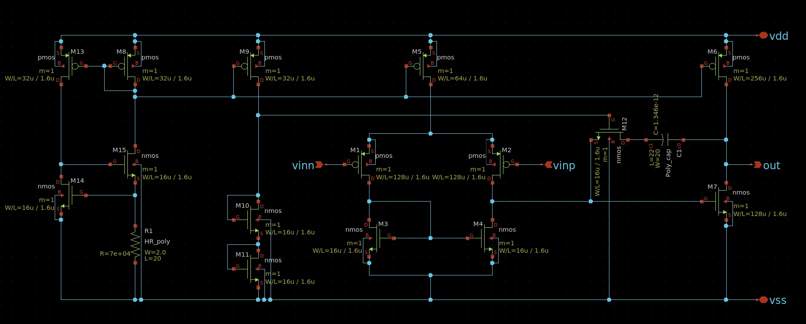
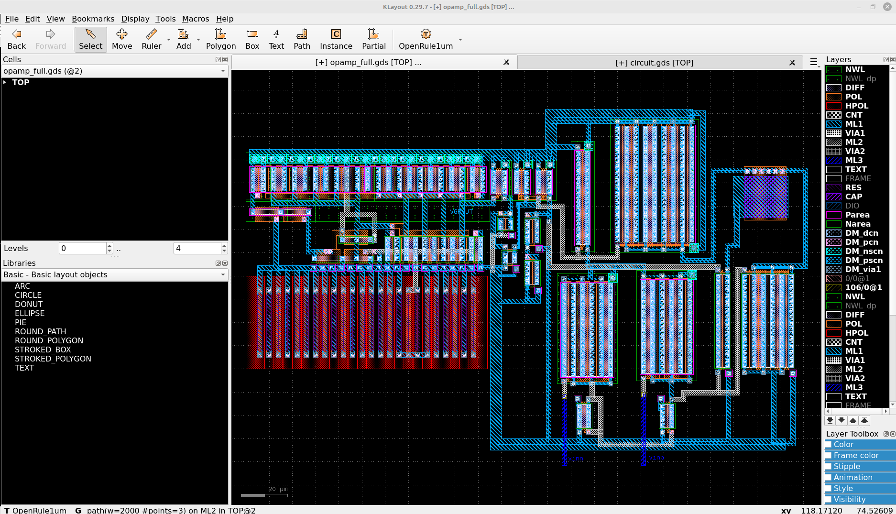
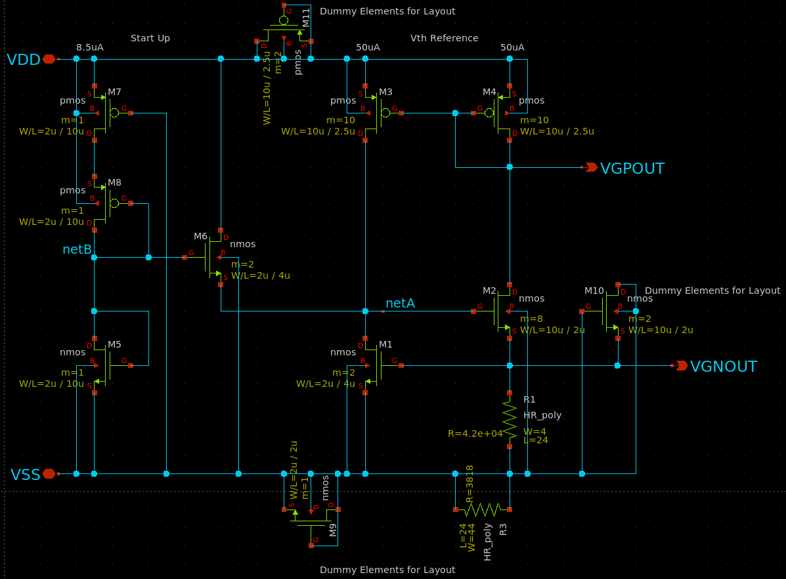

# ISHI会版OpenMPW PTC06-2のOPAMPのグループワーク
[ISHI会版OpenMPW PTC06-2のOPAMPのグループワーク](https://ishi-kai.org/openmpw/shuttle/ptc06/2025/06/14/shuttle_ISHI-Kai_OpenMPW-PTC06-2_OPAMP_Team.html)のチームアンドゥーの成果物置き場です。

## チームメンバー
| GitHub ユーザー名 | Discord ユーザー名 | Discord 表示名 |
|-------------------|------------------|-----------------|
| [@carbon_hero](https://github.com/dokunira/OPAMP_PTC06-2) | @dokunira | アンドゥー |
| [@foorests](https://github.com/foorests/opamp_ISHI) | @forest3187 | forest3187 |
| [@ugeugeHigh](https://github.com/ugeugeHigh/opamp_ishi) | @xian2451 | Xian DIY (ueda gen) |
| [@YuMaehashi](https://github.com/YuMaehashi/ISHI-KAI/tree/main/PTC06/202508_OPAMP) | @yum_42 | Maehashi |

## グループワーク
2025年6月29日から2025年8月10日まで毎週日曜日の21時からミーティングを行い、互いの進捗の確認や疑問点の解消を行いました。

[Discord上の活動場所へのリンク](https://discord.com/channels/1087260891264856144/1383814373784551565)

## 成果物
### [dokunira](https://github.com/dokunira/OPAMP_PTC06-2):オペアンプ
#### 感想
毎週ミーティングを開き、メンバーの助言をもらいながら、初めてのオペアンプ設計に挑戦しました。トランジスタのW/L比や抵抗値といった回路素子一つ一つのパラメータが、回路全体の性能に複雑に影響し合い、調整は想像以上に難しかったです。大変貴重な経験をさせていただきました。ありがとうございました。

### [foorests](https://github.com/foorests/opamp_ISHI)：オペアンプ
#### 感想
アナログ回路で代表的なオペアンプについて、学びながら回路図・レイアウトを書くという貴重な経験をさせていただきました。
今回はグループワークということで毎週集まりながらオペアンプを作っていたのですが、そこで様々な助言をいただいてなんとか完走することができました。また土屋先生のOPAMP設計講座も参考になりました。
非常に充実して楽しい時間でした。皆様本当にありがとうございました！

### [ugeugeHigh](https://github.com/ugeugeHigh/opamp_ishi)：オペアンプ
#### 感想
前回Inverterを作ってみようの会に参加し、
次のステップとしてOPAMPのグループワークに参加させていただきました。
(https://github.com/ugeugeHigh/ISHI_xian_first)
KiCad等で回路設計して基板を作るところまではよくやりますが、
ICチップの中身を作れるというのはワクワクしますよね！  
このような機会を頂きありがとうございます！

大学・大学院ではグラフェンデバイスを作ったり、
液体ヘリウム温度下でデバイス物性の評価などをしていていましたが、  
思い返すとOPAMPについてしっかり勉強したことが無くて、中々理解するのがハードでした。
まだ理解が追いついていない部分が結構あります。

またレイアウトを作る部分はかなり苦戦しました。
チームの皆様に助けて頂きながら、なんとかgdsファイルをつくることができました。ありがとうございました！

低電流源回路部分はMaehashiさんの回路を使わせて頂きました。ありがとうございます。

### [YuMaehashi](https://github.com/YuMaehashi/ISHI-KAI/tree/main/PTC06/202508_OPAMP)：定電流源 ([ugeugeHigh](https://github.com/ugeugeHigh/opamp_ishi)のオペアンプに使用)
#### 感想
ISHI会に入って初のイベント。主な対象は初学者のようだったが、アンプ設計からは遠のいていたので復習を兼ねて参加。

毎週のミーティングでは主に他メンバーのサポートをしていたが、理解があやふやだったり忘れてしまった内容が多い事に気づき、良い勉強になった。

また、オープンソースPDK/EDAに触れるのが初めてだったこともあり、主にアプリの使い方を調べるために多くの時間を費やしてしまったため、なかなか設計に使う時間が取れず自分自身での設計は定電流源回路のみとなってしまった。次に同様のイベントに参加する際には最後までやり遂げたい。

大変貴重な経験をさせていただき、ありがとうございました。

