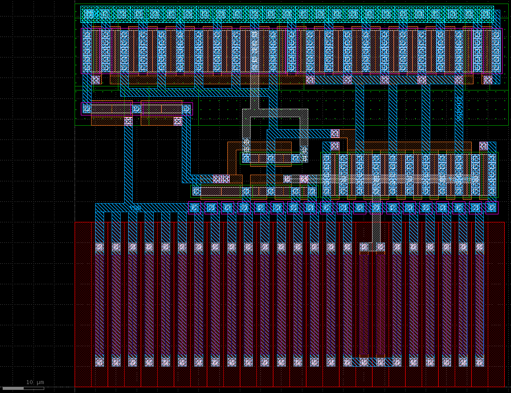

## 参加イベント
[ISHI会版OpenMPW PTC06-2のOPAMPのグループワーク](https://ishi-kai.org/openmpw/shuttle/ptc06/2025/06/14/shuttle_ISHI-Kai_OpenMPW-PTC06-2_OPAMP_Team.html)
　
## 感想
ISHI会に入って初のイベント。主な対象は初学者のようだったが、アンプ設計からは遠のいていたので復習を兼ねて参加。

毎週のミーティングでは主に他メンバーのサポートをしていたが、理解があやふやだったり忘れてしまった内容が多い事に気づき、良い勉強になった。

また、オープンソースPDK/EDAに触れるのが初めてだったこともあり、主にアプリの使い方を調べるために多くの時間を費やしてしまったため、なかなか設計に使う時間が取れず自分自身での設計は定電流源回路のみとなってしまった。次に同様のイベントに参加する際には最後までやり遂げたい。

大変貴重な経験をさせていただき、ありがとうございました。

## 成果物
定電流源回路 回路設計＆レイアウト設計
[このリポジトリ内に含まれる定電流源回路です](https://github.com/ugeugeHigh/opamp_ishi)

## 特性

## 回路図

## レイアウト

## テストベンチ

## シミュレーション結果詳細
[DesignReport.pptx](DesignReport.pptx)