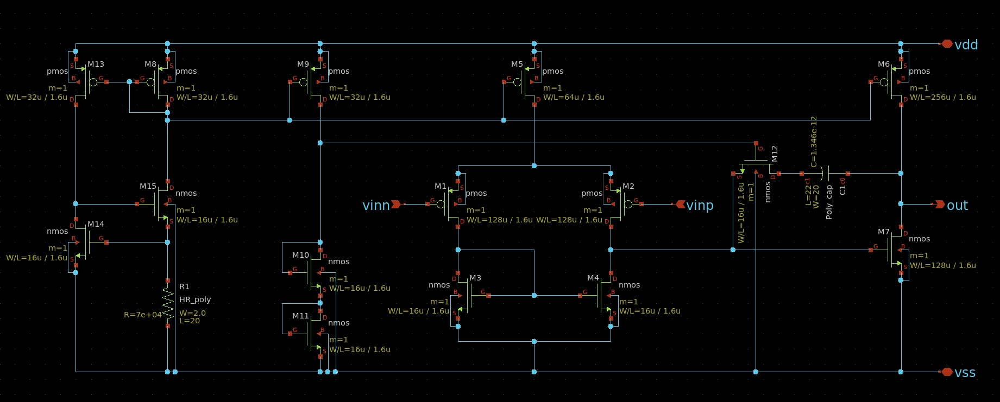
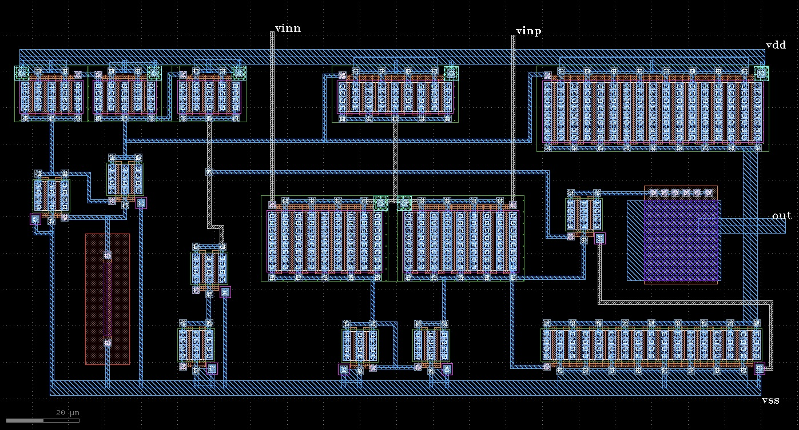
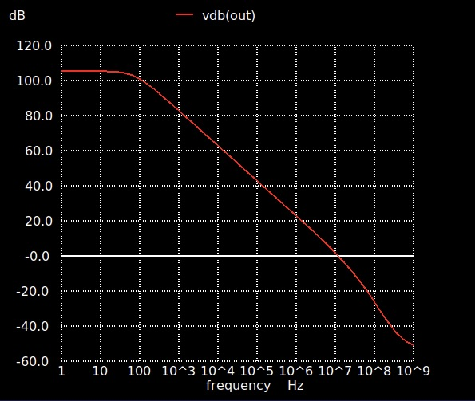
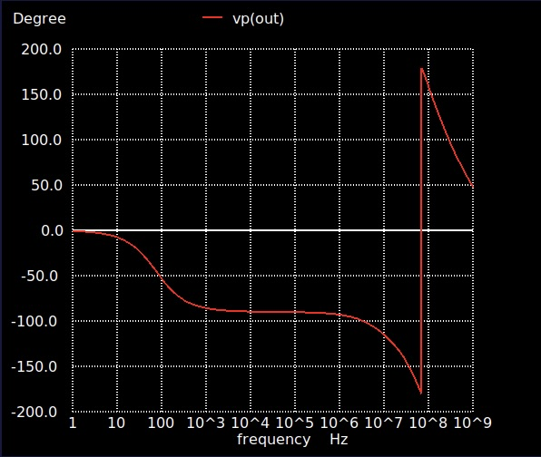
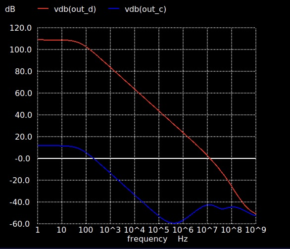
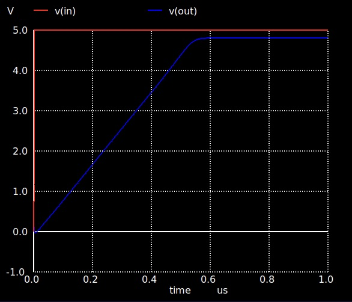

## 参加イベント
[ISHI会版OpenMPW PTC06-2のOPAMPのグループワーク](https://ishi-kai.org/openmpw/shuttle/ptc06/2025/06/14/shuttle_ISHI-Kai_OpenMPW-PTC06-2_OPAMP_Team.html)
　
## 感想
毎週ミーティングを開き、メンバーの助言をもらいながら、初めてのオペアンプ設計に挑戦しました。トランジスタのW/L比や抵抗値といった回路素子一つ一つのパラメータが、回路全体の性能に複雑に影響し合い、調整は想像以上に難しかったです。大変貴重な経験をさせていただきました。ありがとうございました。

## 特性
| 項目 | 値 |
| --- | --- |
| 直流利得 | 105 dB |
| 単位利得周波数 | 1.18 MHz |
| 位相余裕 | 61.6° |
| CMRR | 97 dB |
| スルーレート | 9.0 V/μs |

## 回路図

## レイアウト

## オープンループ特性

## CMRR評価

## 過渡応答

