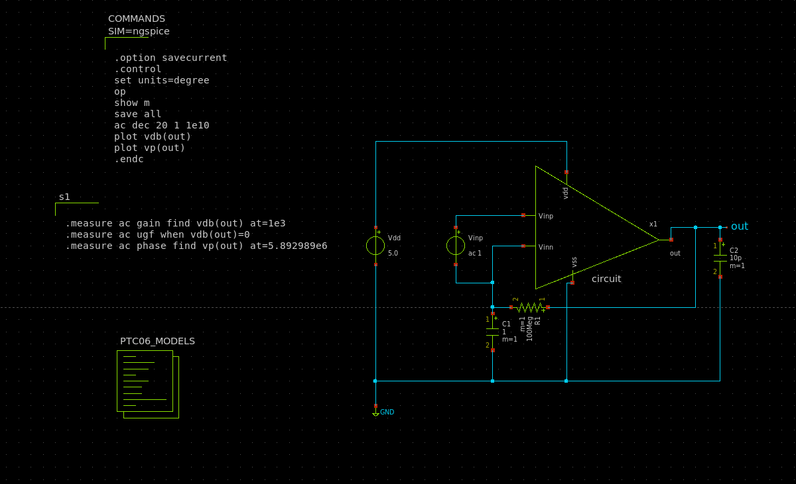
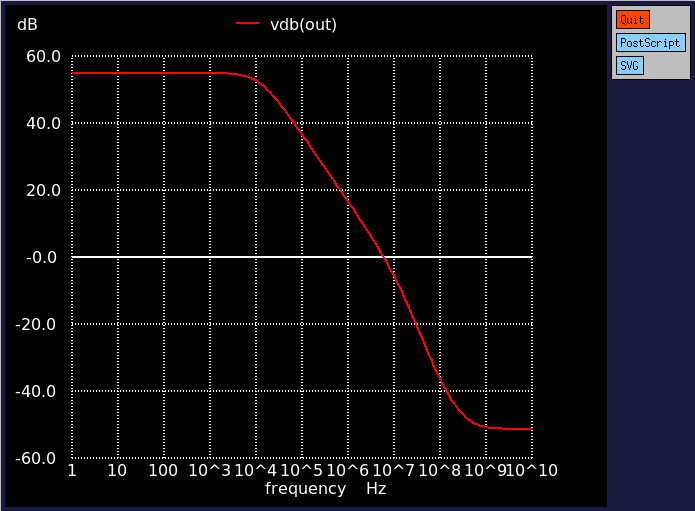
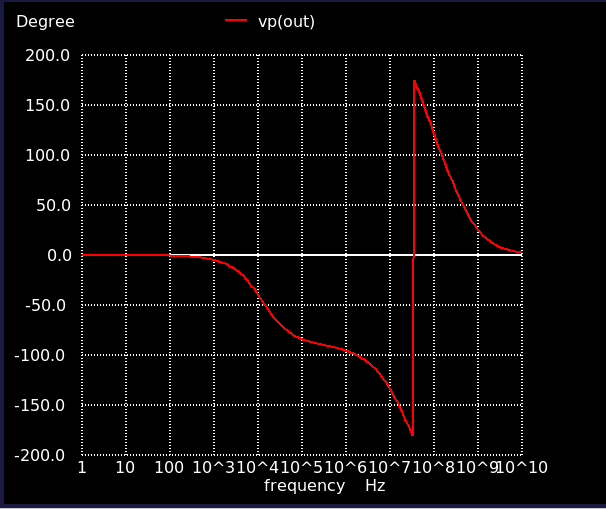

# 参加イベント
[ISHI会版OpenMPW PTC06-2のOPAMP設計](https://ishi-kai.org/openmpw/shuttle/ptc06/2025/06/14/shuttle_ISHI-Kai_OpenMPW-PTC06-2_OPAMP_Team.html)

# 感想
アナログ回路で代表的なオペアンプについて、学びながら回路図・レイアウトを書くという貴重な経験をさせていただきました。
今回はグループワークということで毎週集まりながらオペアンプを作っていたのですが、そこで様々な助言をいただいてなんとか完走することができました。また土屋先生のOPAMP設計講座も参考になりました。
非常に充実して楽しい時間でした。皆様本当にありがとうございました！

# 回路図

# テスト回路

# 振幅特性

# 位相特性

# レイアウト
